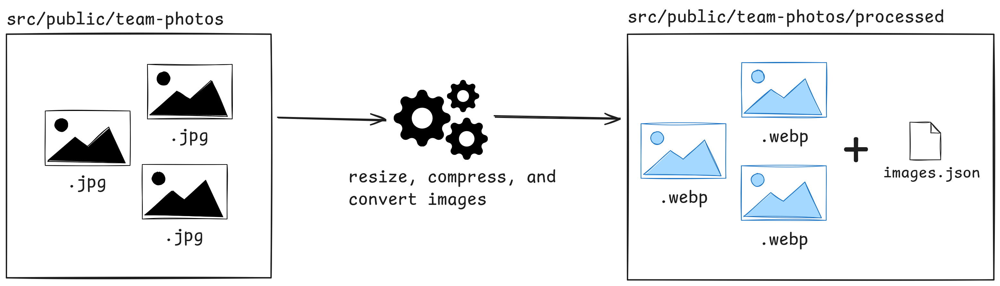

# Imperative to Effect Kata

Refactoring kata to practice the conversion of an imperative codebase to a functional one,
using [Effect](https://effect.website/) TypeScript library.

_Original kata created by Massimo Iacolare [imperative-to-fp-kata](https://github.com/iacoware/imperative-to-fp-kata/)._

---

Table of contents:

- [Your Task](#your-task)
- [Getting Started](#getting-started)
- [Suggestions](#suggestions)
- [Solutions](#solutions)

## Your Task

The application resize and compress all the images found in `src/public/team-photos` and write them into
`public/team-photos/processed`. It also generate a json file (`images.json`) with the list of the processed images and
their metadata.

You should refactor the codebase to transition from an imperative to a functional one using Effect library.
While doing so, remember to follow _one rule_:
**ensure that the application remains fully functional after each change.**

One the goals of this kata, is to simulate a real world scenario in which you need to introduce a new programming style,
and in this case a library, into a production application without breaking it.



## Getting Started

Install node 22+ and `pnpm` package manager.

Install dependencies:

```shell
pnpm install
```

Run the application:

```shell
pnpm start
```

Run typechecker:

```shell
pnpm run typecheck
# watch mode
pnpm run typecheck:w
```

Run tests:

```shell
pnpm run test
# watch mode
pnpm run test:w
```

After you checked all previous commands works, you can open [src/index.ts](./src/index.ts) and start refactoring!

### Effect

See [Effect quickstart](./docs/effect-quickstart.md) for a quick introduction to Effect library and how to use it.

## Suggestions

A list of suggestions you can do during this kata:

- Introduce [domain errors](https://effect.website/docs/error-management/two-error-types/) and handle them properly
- Apply [dependency inversion principle](https://effect.website/docs/requirements-management/services/) to avoid direct
  access to file system and image processing library (sharp)
- Create a [CLI](https://github.com/Effect-TS/effect/blob/main/packages/cli/README.md) to remove hardcoded
  configurations and make this script more reusable

## Solutions

- [October 2025](https://github.com/devmatteini/imperative-to-effect-kata/tree/solution)
- [February 2026](https://github.com/devmatteini/imperative-to-effect-kata/tree/solution-2026-02)
